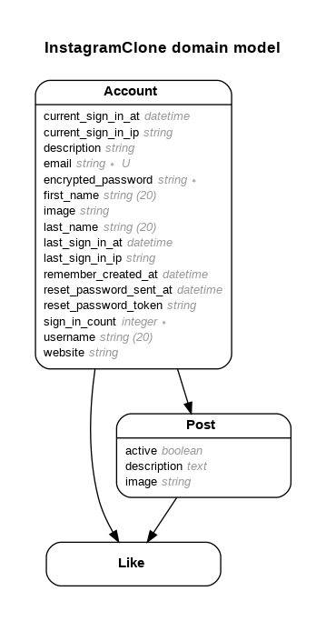

# INSTAGRAM CLONE

https://www.youtube.com/watch?v=dqjF3C9A-Yg&list=PL-1jnVsiYID5HpCRxhsfEuscBXWrWuB6s&index=1

## Model


## Version
- ruby 3.0.1p64 (2021-04-05 revision 0fb782ee38) [x86_64-linux]
- Rails 6.1.4

## System dependencies

## Configuration
Carrierwave Steps:
```sh
$ rails g uploader Image # will create app/uploaders/image_uploader.rb
$ touch config/initializers/carrierwave.rb
$ touch config/application.yml # set local environment variables used by figaro
```
Change to `storage :fog` in `image_uploader.rb`.
Add configuration to `carrierwave.rb`
Add environment variables in `application.yml`

Connect model to uploader file. In 'app/models/post.rb' add:
```ruby
mount_uploader :image, ImageUploader
```
Use mount_uploaders for multiple file uploads and mount_uploader for single file uploads. Post model has field image that is of type string.

Create controller in `app/controller/posts_controller.rb`
Create form/view in `app/views/posts/new.html.erb`

If webpacker stops responding to changes in application.scss or application.js, run this command in terminal:
```bash
$ rails webpacker:install
```

## Database creation
```sh
$ gem install pg
$ sudo apt-get update
$ sudo apt install postgresql postgresql-contrib libpq-dev
# Create a new database role
$ sudo -u postgres createuser -s dynamic -P
```
Instead of dynamic use the linux username you are logged in with.

In file `config/database.yml`:
```yaml
...
default: &default
  adapter: postgresql
  encoding: unicode
  # For details on connection pooling, see Rails configuration guide
  # http://guides.rubyonrails.org/configuring.html#database-pooling
  pool: <%= ENV.fetch("RAILS_MAX_THREADS") { 5 } %>
  username: dynamic
  password: your password here

development:
  <<: *default
  database: appname_development

```
Instead of dynamic use the linux username you are logged in with

## Database initialization
```sh
$ rails db:create
$ rails db:migrate

```

## How to run the test suite

## Services (job queues, cache servers, search engines, etc.)

## Deployment instructions
Run in terminal:
```sh
$ rake webpacker:install
$ sudo service postgresql start
```

## References
- https://www.digitalocean.com/community/tutorials/how-to-use-postgresql-with-your-ruby-on-rails-application-on-ubuntu-18-04
- Bootstrap Bare Template - https://startbootstrap.com/template/bare
